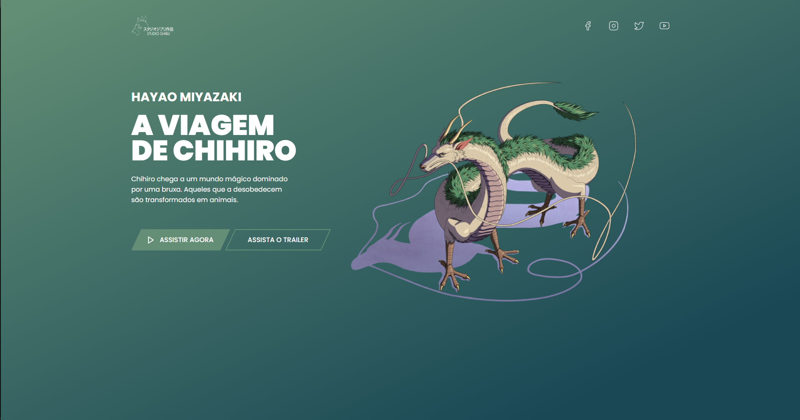
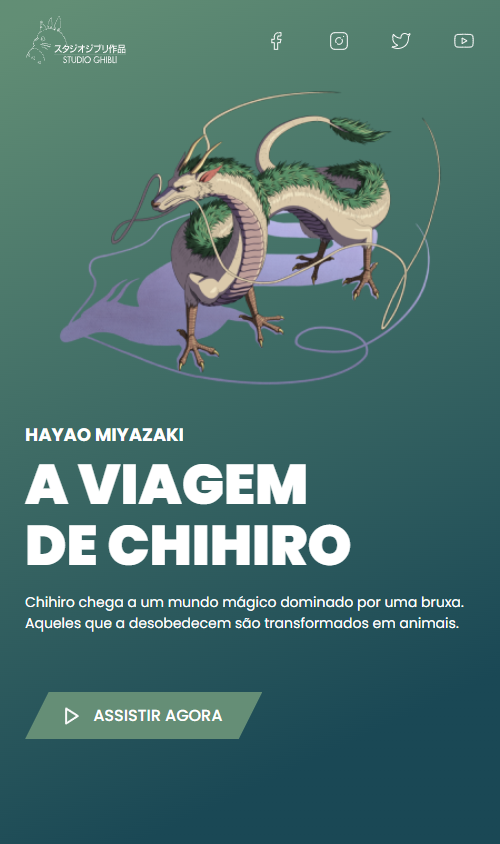

  

## 🚀  Tecnologias

Esse projeto foi desenvolvido com as seguintes tecnologias:

-   React JS

-   JavaScript

Bibliotecas

-   Styled-components

## 💻  Projeto

A viagem de Chihiro. O que falar desse filme? Um filme que já assisti no mínimo 10 vezes e que marcou minha infância. A trama conta a história de uma garotinha que se aventura em um mundo fantasma, povoado por seres fantásticos, após seus pais serem transformados em porcos. O mesmo ganhou trinta e cinco prêmios, dentre eles, o Oscar de melhor animação em 2003. Studio Ghibli é sensacional! Recomendo a todas as idades! ⛩️

